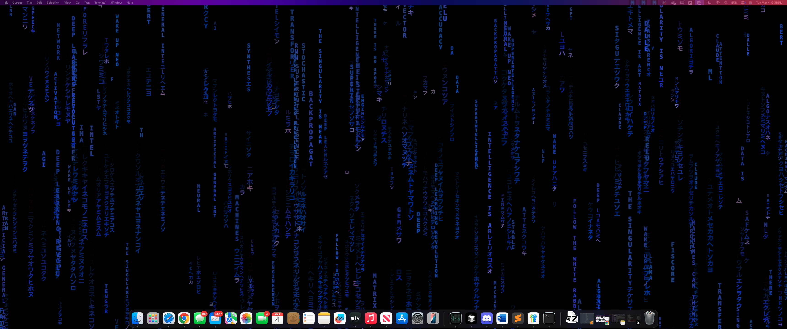

# DigitalRain

A dynamic Matrix-style animation that creates a stunning digital rain effect behind your applications.



## Features

- Beautiful Matrix-style digital rain animation with customizable appearance
- Runs behind your applications as a dynamic wallpaper
- Supports multiple displays
- Minimal system resource usage
- Automatic startup option
- Easy-to-use tray controls

## Installation

### Option 1: Quick Installation (Recommended)

1. Run the installation script:
   ```
   ./install.sh
   ```
   
   This will build the application, install it to your Applications folder, and configure it to start at login.

### Option 2: Manual Installation

1. Build the application:
   ```
   npm run build
   ```

2. Open the DMG file created in the `dist` directory
3. Drag the application to your Applications folder
4. Open the application from your Applications folder

## Using DigitalRain

DigitalRain runs as a set of fullscreen windows that sit behind your other applications, effectively functioning as a dynamic wallpaper.

### Controlling DigitalRain

#### Tray Icon

Look for the DigitalRain icon in your menu bar. Click it to access these options:

- **Show/Hide Wallpaper**: Toggle visibility of the animation
- **Refresh All Displays**: Recreate windows for all displays
- **About**: Information about the application
- **Quit**: Exit the application

#### Keyboard Shortcuts

- **Cmd+Option+M**: Toggle visibility of the animation

## Development

### Prerequisites

- Node.js and npm
- macOS (developed and tested on macOS 11 and later)

### Setting Up Development Environment

1. Clone the repository:
   ```
   git clone https://github.com/yourusername/digitalrain.git
   cd digitalrain
   ```

2. Install dependencies:
   ```
   npm install
   ```

3. Run the application in development mode:
   ```
   npm start
   ```

### Building from Source

To build the application as a distributable macOS app:

```
npm run build
```

This creates a DMG file in the `dist` directory that you can install like any other macOS application.

## Troubleshooting

If you don't see the animation:

1. Make sure you've granted necessary permissions in System Settings > Privacy & Security > Accessibility
2. Check if the application is running (look for the tray icon)
3. Try restarting the application by quitting it from the tray menu and reopening it
4. Ensure your graphics drivers are up to date

## License

MIT License - See LICENSE file for details

## Acknowledgements

- Inspired by the classic Matrix digital rain effect
- Built with Electron and Canvas 